# Blue Archive Auto Chess Game
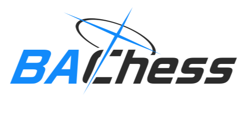

> A text-based auto chess game implemented in Python where players strategically purchase, deploy, and battle with units to defeat their opponents.

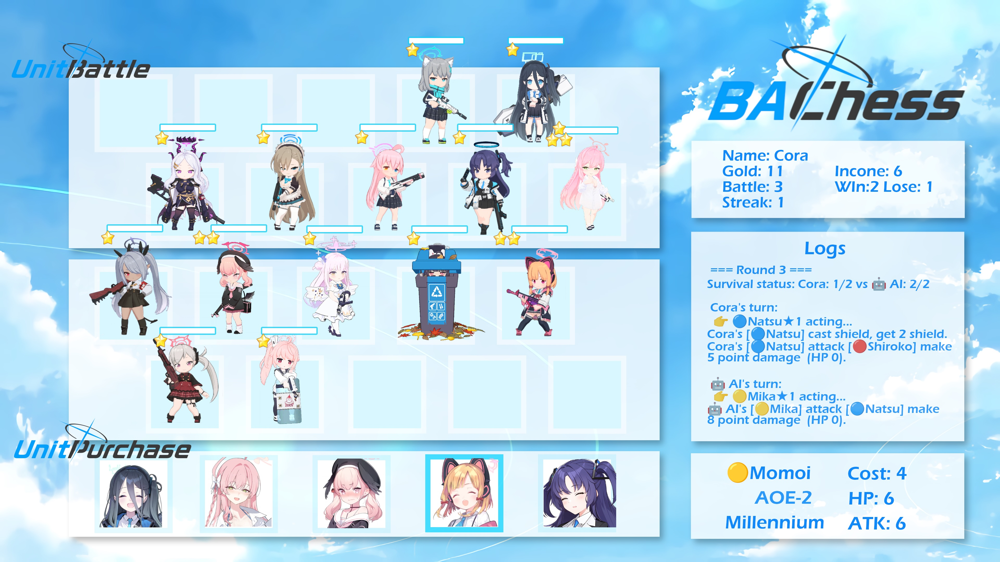
## 🎮 Game Features
- **Strategic Unit Management**: Buy units, merge identical ones to upgrade stars, and deploy them for battle
- **Element System**: 🔴 > 🔵 > 🟡 > 🔴 with 2x damage bonus and 0.5x damage penalty
- **School Synergies**: Units from the same school gain +1 ATK when there are 2+ of them
- **Various Unit Skills**: AOE attacks, shields, healing, and more
- **Economy System**: Earn gold through income, interest, and loss streaks
- **Automatic Battles**: Units fight autonomously using their skills and abilities

## 🏗️ Project Structure
### 🎲 Gameplay
1. **Income Phase**: Receive gold based on base income, interest, and loss streak
2. **Shopping Phase**: Purchase units to add to your reserve
3. **Deployment**: First 10 units in your reserve are automatically deployed
4. **Battle**: Units automatically attack and use skills in combat
5. **Results**: Win/lose based on which team has more surviving units
### 💡 Strategic Elements
- **Unit Merging**: Combine 2 identical units to create a stronger ⭐⭐ unit
- **School Planning**: Deploy units from the same school to gain attack bonuses
3. **Element Matching**: Use favorable element matchups against your opponent
4. **Economy Management**: Balance spending versus saving for interest income
## 🕹️ How To Play
### Download
1. `git clone https://github.com/Ccong1001/Blue-Archive-Auto-Chess.git`
2. `cd Blue-Archive-Auto-Chess`
3. `python ba_auto_chess/main.py`

### Run the game:
#### 1. View the tutorial (optional)
```
=== Welcome to Mini Auto Chess Game! ===
Would you like to see the game tutorial? (y/n): y
Choose language / 选择语言 (en/zh): en

╔════════════════════════════════════════════════════════════╗
║                  MINI AUTO CHESS GUIDE                     ║
╚════════════════════════════════════════════════════════════╝

【GAME CONCEPT】
Auto Chess is a strategic board game where you need to purchase units, upgrade them, 
and arrange your lineup wisely to defeat your opponent.

【BASIC CONCEPTS】
• Units: Each unit has Name, HP, ATK, Skill, School, and Element
• Element System: 🔴>🔵>🟡>🔴 (2x damage bonus, 0.5x damage penalty)
• Star Level: Combine three identical units to level up, increasing HP by 80% and ATK by
 50%
• School Synergy: Having 2+ units from the same school gives +1 ATK bonus

【GAME FLOW】
1. At the start of each round, get basic gold + interest (current gold÷10) + failure com
pensation
2. Purchase units and add them to your reserve
3. The first 10 units in your reserve will automatically enter battle
4. Units automatically attack enemies and use skills during battle
5. Play for 5 rounds, victory determined by number of wins

【UNIT SKILLS】
• AOE-all: Deal half ATK damage to all enemies
• AOE-3: Deal one-third ATK damage to 3 random enemies
• AOE-2: Deal half ATK damage to 2 random enemies
• shield: Provide shield equal to half your ATK
• heal: Restore half ATK worth of HP to all friendly units

【STRATEGY TIPS】
• Actively collect identical units to upgrade stars
• Try to activate school synergy effects
• Pay attention to element relationships for favorable matchups
• Prioritize upgrading high-star units for significant power boosts
• Maintain a good amount of gold to earn more interest

【CONTROLS】
• Buy units: Enter corresponding numbers (space-separated for multiple purchases)
• End shopping: Press Enter directly
• The first 10 units in your reserve will automatically deploy, so arrange them carefull
y

Enjoy the game!


Press Enter to return to game... / 按Enter键返回游戏...
```
#### 2. Enter your name
```
Enter your name: Cora

Welcome, Cora!
```
#### 3. Purchase units by entering their indices
```
🌟🌟 Round 1 🌟🌟
===== Cora's Shopping =====
Cora gets income: base 5 + interest 0 + loss streak 0 = 5 gold.
Cora has 10 gold.
Idx  Name         Gold  HP    ATK   Skill           School
------------------------------------------------------------
0    🔵Natsu       5     12    5     shield          Trinity
1    🔴Koharu      4     6     3     heal            Trinity
2    🔴Mutsuki     5     6     6     AOE-3           Gehenna
3    🔵Asuna       3     8     5     /               Millennium
4    🔵Alice       4     5     6     AOE-3           Millennium

Input the numbers you want to buy (space-separated, or Enter to skip): 0
Cora bought 🔵Natsu
Input the numbers you want to buy (space-separated, or Enter to skip): 2
Cora bought 🔴Mutsuki

== Cora's Final Units After Shopping ==
No.  Name         ★  HP    ATK   Skill      School
------------------------------------------------------------
0    🔵Natsu       1  12    5     shield     Trinity
1    🔴Mutsuki     1  6     6     AOE-3      Gehenna
Active synergies: 

===== 🤖 AI's Turn (AI) =====
🤖 AI gets income: base 5 + interest 0 + loss streak 0 = 5 gold.
🤖 AI has 10 gold.
🤖 AI bought 🟡Mika
🤖 AI bought 🔴Shiroko

== 🤖 AI's Final Units After Shopping ==
No.  Name         ★  HP    ATK   Skill      School
------------------------------------------------------------
0    🟡Mika        1  10    8     /          Trinity
1    🔴Shiroko     1  8     4     /          Abydos
Active synergies: 

Press Enter to start battle...
```
#### 4. Watch the battle unfold between your units and the AI opponent
```
========== BATTLE START ==========

 Cora's lineup:
  [1] 🔵Natsu★1 - HP: [██████████] 12/12, ATK: 5, Skill: shield, School: Trinity
  [2] 🔴Mutsuki★1 - HP: [██████████] 6/6, ATK: 6, Skill: AOE-3, School: Gehenna

 🤖 AI's lineup:
  [1] 🟡Mika★1 - HP: [██████████] 10/10, ATK: 8, Skill: /, School: Trinity
  [2] 🔴Shiroko★1 - HP: [██████████] 8/8, ATK: 4, Skill: /, School: Abydos

 === Round 1 === 
Survival status: Cora: 2/2 vs 🤖 AI: 2/2

 Cora's turn:
  👉 🔵Natsu★1 acting...
Cora's [🔵Natsu] cast shield, get 2 shield.
Cora's [🔵Natsu] attack [🟡Mika] make 2 point damage ❄️RESIST❄️ (HP 8).
  👉 🔴Mutsuki★1 acting...
Cora's [🔴Mutsuki] cast AOE-3, make attack to 2 enemies.
Cora's [🔴Mutsuki] attack [🟡Mika] make 2 point damage  (HP 6).
Cora's [🔴Mutsuki] attack [🔴Shiroko] make 4 point damage ⚡EFFECTIVE⚡ (HP 4).

 🤖 AI's turn:
  👉 🟡Mika★1 acting...
🤖 AI's [🟡Mika] attack [🔴Mutsuki] make 4 point damage ❄️RESIST❄️ (HP 2).
  👉 🔴Shiroko★1 acting...
🤖 AI's [🔴Shiroko] attack [🔴Mutsuki] make 8 point damage ⚡EFFECTIVE⚡ (HP 0).

 === Round 2 === 
Survival status: Cora: 1/2 vs 🤖 AI: 2/2

 🤖 AI's turn:
  👉 🟡Mika★1 acting...
🤖 AI's [🟡Mika] attack [🔵Natsu] make 8 point damage  (HP 4).
  👉 🔴Shiroko★1 acting...
🤖 AI's [🔴Shiroko] attack [🔵Natsu] make 2 point damage ❄️RESIST❄️ (HP 2).

 Cora's turn:
  👉 🔵Natsu★1 acting...
Cora's [🔵Natsu] cast shield, get 2 shield.
Cora's [🔵Natsu] attack [🟡Mika] make 2 point damage ❄️RESIST❄️ (HP 4).

 === Round 3 === 
Survival status: Cora: 1/2 vs 🤖 AI: 2/2

 Cora's turn:
  👉 🔵Natsu★1 acting...
Cora's [🔵Natsu] cast shield, get 2 shield.
Cora's [🔵Natsu] attack [🔴Shiroko] make 5 point damage  (HP 0).

 🤖 AI's turn:
  👉 🟡Mika★1 acting...
🤖 AI's [🟡Mika] attack [🔵Natsu] make 8 point damage  (HP 0).

🏁 === BATTLE END === 🏁

🏆 🤖 AI wins! (Surviving units: 1)

Post-battle unit status:

 Cora's units:
  [1] 🔵Natsu★1 - HP: [          ] 0/12 - Defeated
  [2] 🔴Mutsuki★1 - HP: [          ] 0/6 - Defeated

 🤖 AI's units:
  [1] 🟡Mika★1 - HP: [████      ] 4/10 - Alive
  [2] 🔴Shiroko★1 - HP: [          ] 0/8 - Defeated
Press Enter to continue...
```
#### 5. Repeat for 5 rounds to determine the overall winner
```
🎮 Game Over! Thanks for Playing!

Cora won 0 rounds, 🤖 AI won 5 rounds.
Better luck next time, Cora!
```
## 🛠️ Unit Skills
- AOE-all: Deal half ATK damage to all enemies
- AOE-3: Deal one-third ATK damage to 3 random enemies
- AOE-2: Deal half ATK damage to 2 random enemies
- shield: Provide shield equal to half your ATK
- heal: Restore half ATK worth of HP to all friendly units

## 🌟 Unit Gallery
| | | | |
| :---------------------: | :---------------------: | :---------------------: | :---------------------: |
| **Millennium** |
|         🟡Momoi          |         🔴Yuuka          |         🔵Alice          |         🔵Asuna          |
| 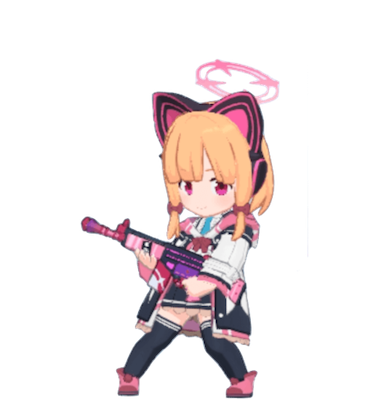 |  |  | 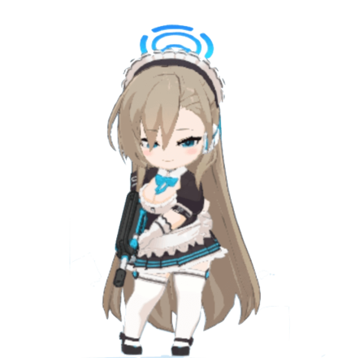 |
| [cost]4 / [hp]6 / [atk]6 | [cost]4 / [hp]15 / [atk]3 | [cost]4 / [hp]5 / [atk]6 | [cost]3 / [hp]8 / [atk]5 |
| AOE-2 | shield | AOE-3 | / |
| **Trinity** |
|           🟡Mika           |            🔴Koharu            |            🔵Natsu           |            🔵Hanako            |
|  | 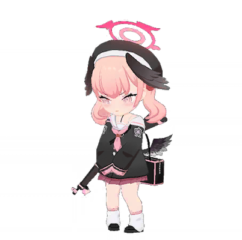 |  |  |
| [cost]7 [hp]10 [atk]8 | [cost]4 [hp]6 [atk]3 | [cost]5 [hp]12 [atk]15 | [cost]3 [hp]5 [atk]4 |
| / | heal | shield | AOE-all |
| **Gehenna** |
|           🔴Hina           |             🔴Mutsuki            |            🔵Iroha           |           🟡Iori           |
| 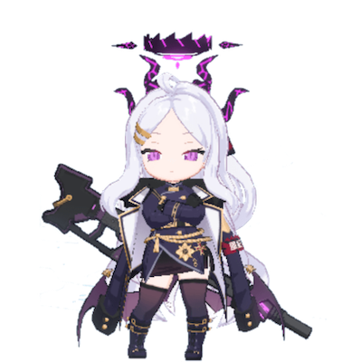 | 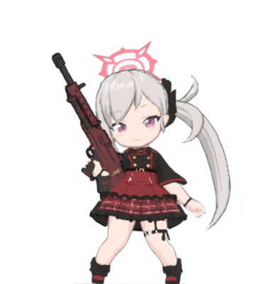 |  | 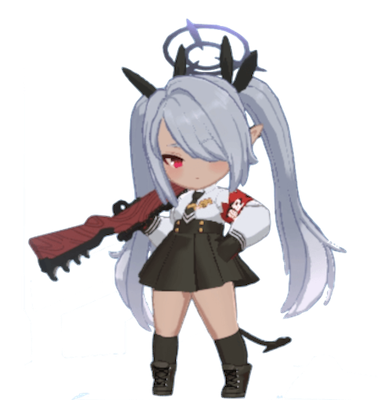 |
| [cost]6 [hp]8 [atk]9 | [cost]5 [hp]6 [atk]6 | [cost]10 [hp]6 [atk]6 | [cost]4 [hp]6 [atk]4 |
| / | AOE-3 | AOE-all | / |
| **Others** |
|             🟡Hoshino            |             🔴Shiroko            |           🟡Mizu           | |
| 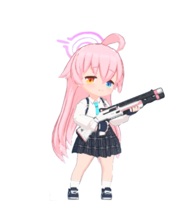 | 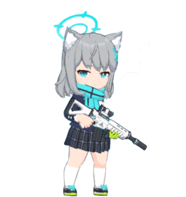 | 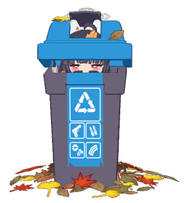 | |
| [cost]5 [hp]14 [atk]4 | [cost]3 [hp]8 [atk]4 | [cost]4 [hp]7 [atk]5 | |
| shield | / | / | |

## Coming Soom (maybe?)
- Visualization